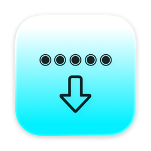
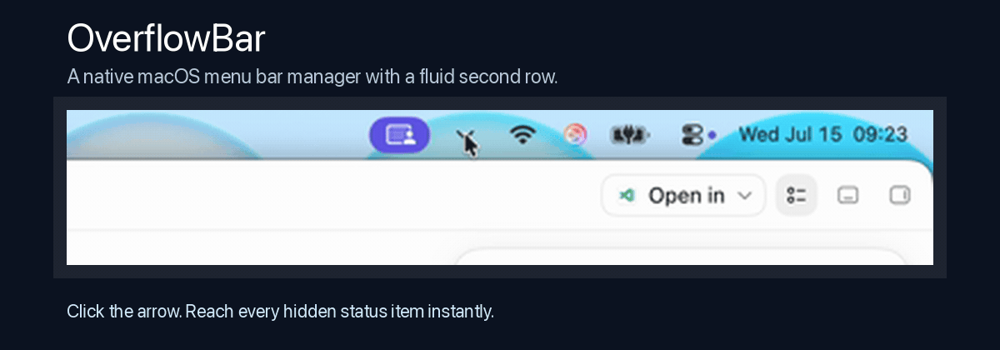

<p align="center">
  
</p>

# OverflowBar

> **A fluid second row for your macOS menu bar.**

[](https://github.com/EvanProgramming/OverflowBar/releases/latest)
[](https://github.com/EvanProgramming/OverflowBar/actions/workflows/build.yml)




OverflowBar keeps a crowded Mac menu bar tidy by moving selected status items behind one persistent arrow, then revealing them in a fast, native second row whenever you need them.

**[Download the latest DMG](https://github.com/EvanProgramming/OverflowBar/releases/latest)** · [Installation](docs/INSTALLATION.md) · [User guide](docs/USAGE.md) · [Roadmap](docs/ROADMAP.md)

## Why OverflowBar?

- **More room, less clutter** — choose which third-party status items stay behind the OverflowBar arrow.
- **Instant access** — click the arrow or move the pointer to the menu bar to reveal the second row.
- **Real menu bar controls** — icons are captured from the live status items; selecting one activates its original control.
- **Native macOS design** — Liquid Glass on macOS 26+, with a lightweight material treatment on macOS 15.
- **System controls stay safe** — Wi-Fi, Battery, Siri, Control Center, and Clock remain visible and are restored if a previous layout left them offscreen.
- **Built for real displays** — respects safe areas, notches, multiple displays, full-screen spaces, and reduced-motion settings.

## Quick start

1. Download `OverflowBar-*.dmg` from the [latest release](https://github.com/EvanProgramming/OverflowBar/releases/latest).
2. Drag **OverflowBar** into **Applications**.
3. Open it and complete the guided Accessibility and Screen Recording setup.
4. Right-click the OverflowBar arrow to choose the items you want to manage.
5. Enable **Hide selected original icons**, then click the arrow to reveal the second row.

The current community build is ad-hoc signed and not yet Apple-notarized. On first launch, macOS may require **Control-click → Open**. See the [installation guide](docs/INSTALLATION.md#first-launch-and-gatekeeper) for details.

## Documentation

| Guide | What it covers |
| --- | --- |
| [Installation](docs/INSTALLATION.md) | Requirements, permissions, updating, uninstalling, and Gatekeeper |
| [User guide](docs/USAGE.md) | Selecting items, second-row interaction, hover reveal, reset, and troubleshooting |
| [Architecture](docs/ARCHITECTURE.md) | Scanner, capture pipeline, layout engine, activation flow, and platform boundaries |
| [Roadmap](docs/ROADMAP.md) | Current priorities and planned releases |
| [Contributing](CONTRIBUTING.md) | Local setup, development workflow, testing, and pull requests |
| [Releasing](docs/RELEASING.md) | Versioning, release checklist, DMG generation, and cadence |
| [Changelog](CHANGELOG.md) | User-visible changes by version |
| [Privacy](PRIVACY.md) | Local capture and permission behavior |
| [Security](SECURITY.md) | Supported versions and responsible disclosure |

## How it works

OverflowBar combines public macOS Accessibility APIs, WindowServer metadata, ScreenCaptureKit, SwiftUI, and AppKit:

1. It discovers right-side status items and associates Accessibility elements with their menu bar windows.
2. It captures each selected item's current icon locally.
3. It uses the same user-facing Command-drag behavior as manual menu bar reordering to place managed items in a hidden section.
4. The second row displays cached copies of those icons.
5. Selecting an icon invokes `AXPress` when available, or briefly reveals and activates the original item before hiding it again.

For component details and data flow, read [Architecture](docs/ARCHITECTURE.md).

## Requirements

- macOS 15 Sequoia or later
- Apple Silicon for the downloadable community DMG
- Accessibility permission for discovery, activation, and managed layout
- Screen Recording permission for live icon capture

## Build from source

Open `OverflowBar.xcodeproj` in Xcode 16 or later and run the `OverflowBar` scheme, or build from Terminal:

```bash
xcodebuild \
  -project OverflowBar.xcodeproj \
  -scheme OverflowBar \
  -configuration Debug \
  -destination 'platform=macOS' \
  build
```

Create an Apple Silicon release DMG with:

```bash
./scripts/create-dmg.sh
```

Artifacts and a SHA-256 checksum are written to `dist/`.

## Project status

OverflowBar is an early public release. The core discover, hide, reveal, and activate flow works on macOS 15 and macOS 26, but menu bar management relies on OS behavior that Apple does not expose as a dedicated public API. Compatibility work is therefore an ongoing priority.

If something does not behave correctly, use **Settings → Safe Reset** before quitting and file a [bug report](https://github.com/EvanProgramming/OverflowBar/issues/new?template=bug_report.yml).

## Community

- Use [GitHub Discussions](https://github.com/EvanProgramming/OverflowBar/discussions) for ideas, setup help, and show-and-tell.
- Use [Issues](https://github.com/EvanProgramming/OverflowBar/issues) for reproducible bugs and scoped feature requests.
- Read [CONTRIBUTING.md](CONTRIBUTING.md) before opening a pull request.

If OverflowBar improves your Mac setup, starring the repository helps other macOS users discover it.
