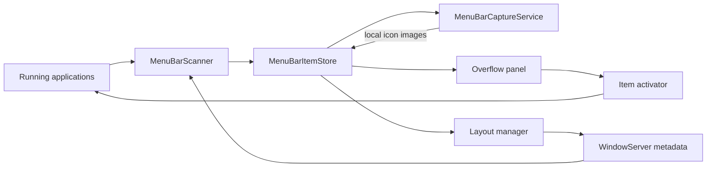

# Architecture

OverflowBar is a native Swift application that combines AppKit for status-bar/window behavior and SwiftUI for onboarding, settings, and the second-row interface.

## Data flow

## Components

### App lifecycle

- `OverflowBarApp` provides the SwiftUI application entry point.
- `AppDelegate` owns the shared store, creates the menu bar controller, presents onboarding/settings, and restores managed items during a normal quit.
- `StatusBarController` owns the visible arrow and the hidden-section delimiter status items.

### Discovery

`MenuBarScanner` performs two complementary passes:

1. Window-list discovery identifies layer-25 status-item windows, including items already moved offscreen.
2. Accessibility traversal associates elements and press actions with matching frames.

System controls receive stable identifiers and are protected from selection. OverflowBar's own status windows are excluded.

### State

`MenuBarItemStore` is the main-actor observable model shared by Settings and the panel. It owns selection persistence, capture generations, layout readiness, activation errors, and public UI operations.

`PreferencesStore` persists selected identifiers, onboarding completion, and layout state with `UserDefaults`.

### Icon capture

`MenuBarCaptureService` uses ScreenCaptureKit as the primary path. A small Core Graphics compatibility path is isolated to offscreen layer-25 windows that ScreenCaptureKit cannot capture on current macOS releases.

Captures happen during refresh and panel presentation, not continuously. Images stay in memory and never leave the device.

### Layout management

macOS does not provide a dedicated public API for third-party apps to reorder or hide arbitrary status items. `MenuBarLayoutManager` therefore reproduces the user-facing Command-drag interaction with WindowServer-targeted events.

The expanding hidden delimiter creates an offscreen managed section to the left of the OverflowBar arrow. Every layout pass excludes live protected-system window IDs and verifies those controls before and after moving selected items.

### Activation

`MenuBarItemActivator` prefers `AXPress`. When direct activation is unavailable, the layout manager temporarily reveals the original item, activates it, and re-hides it after the next user interaction or a bounded timeout.

Targeted events preserve the physical cursor position and validate the final window position before reporting success.

### Presentation

`OverflowPanelController` owns a borderless non-activating `NSPanel` at status-bar level. It chooses the anchor's screen, respects safe-area insets, and closes on outside interaction.

`OverflowPanelView` renders:

- Liquid Glass and materialize transitions on macOS 26+
- an ultra-thin material capsule on macOS 15
- spring transitions and item feedback, with Reduce Motion fallbacks
- horizontal scrolling when content exceeds the display-safe width

## Permissions and trust boundaries

| Capability | API | Permission |
| --- | --- | --- |
| Discover and press accessible controls | Accessibility | Accessibility |
| Capture current status-item icons | ScreenCaptureKit / Core Graphics | Screen Recording |
| Start at login | ServiceManagement | User confirmation through app settings |

OverflowBar performs all discovery, capture, layout, and activation locally.

## Compatibility boundary

The menu bar layout is an OS implementation detail rather than a stable third-party API. Window layers, event delivery, and Accessibility exposure can change between macOS releases. CI validates compilation on the supported deployment target, while release verification also requires live macOS testing.

